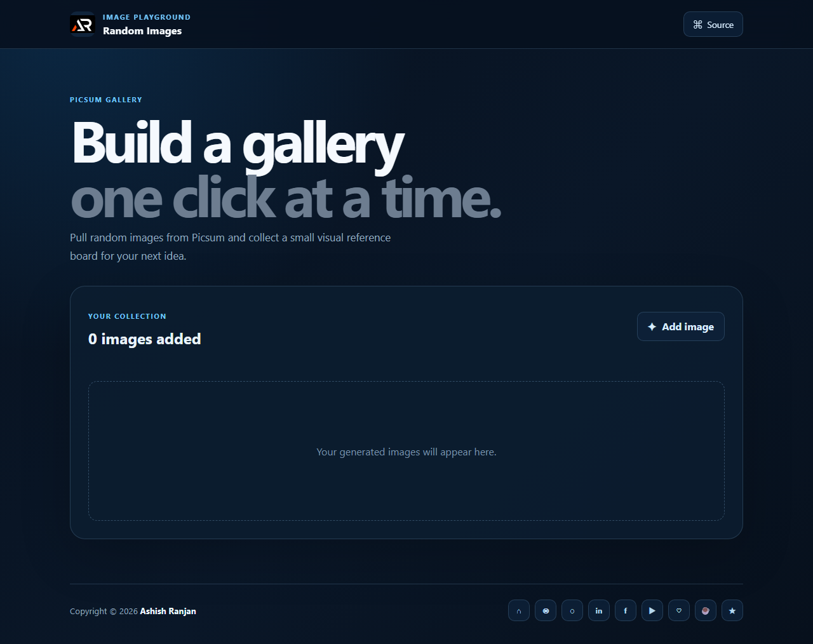

# Random Images

A lightweight HTML, CSS, and JavaScript gallery that adds random Picsum images with one click.

## Features

- Add random Picsum images to a responsive gallery.
- Lazy-load generated images with useful alternative text.
- Display the current image count.
- Fixed branded header, icon footer links, sharing metadata, and scroll-to-top control.

## Tech stack

HTML, CSS, Sass source, and vanilla JavaScript.

## Run locally

Open `index.html` in a browser, or serve the folder with any static file server.

## Deployment

Live app: [https://a2rp.github.io/random_images_html_css_javascript/](https://a2rp.github.io/random_images_html_css_javascript/)

## Links

- Portfolio: [https://www.ashishranjan.net/](https://www.ashishranjan.net/)
- GitHub: [https://github.com/a2rp](https://github.com/a2rp)
- CodePen: [https://codepen.io/ash1198](https://codepen.io/ash1198)
- LinkedIn: [https://www.linkedin.com/in/aashishranjan](https://www.linkedin.com/in/aashishranjan)
- Facebook: [https://www.facebook.com/theash.ashish/](https://www.facebook.com/theash.ashish/)
- YouTube: [https://www.youtube.com/@ashishranjan-ashz?sub_confirmation=1](https://www.youtube.com/@ashishranjan-ashz?sub_confirmation=1)
- Email: [ash.ranjan09@gmail.com](mailto:ash.ranjan09@gmail.com)

## Support

- Support: [https://a2rp-donation-page.netlify.app/](https://a2rp-donation-page.netlify.app/)
- Buy Me a Coffee: [https://buymeacoffee.com/a2rp](https://buymeacoffee.com/a2rp)
- Patreon: [https://patreon.com/a2rp](https://patreon.com/a2rp)
